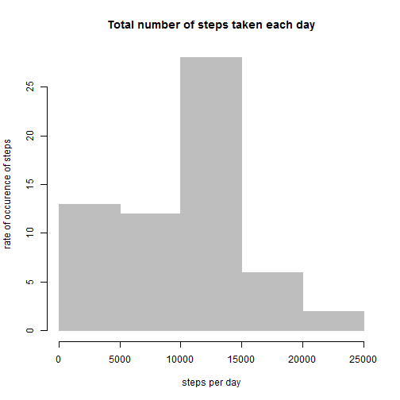
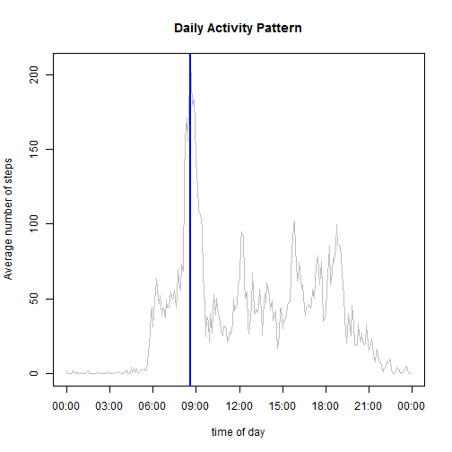
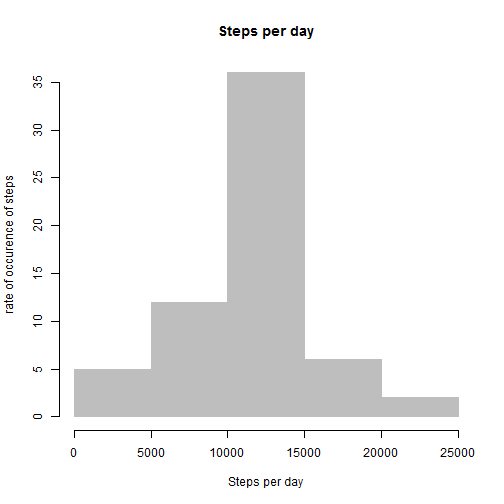
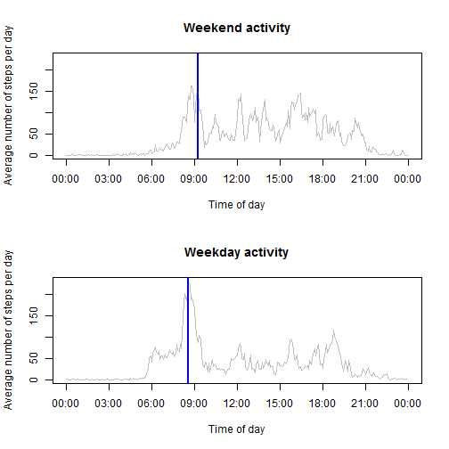

Reproduceable Research Peer Assesment 1
=======================================
The assignment is to answer a set of quetsions about personal activity monitoring devices.
This data was collected between the months of October and November, 2012.

The data can be found at https://d396qusza40orc.cloudfront.net/repdata%2Fdata%2Factivity.zip


```r
#		the following is housecleaning/preprocessing code
#		sets echo= true so R code "under the hood" can be seen
	knitr::opts_chunk$set(echo=TRUE)
	
#		set wd to directory containing activiy.csv
	setwd("C:/Users/Ben/Desktop/Data Science certification/reproducable research/peer assesment 1")

#		read activity.csv into dataframe
	activityData <- read.csv("activity.csv")

#		the following is preprocessing code	
#		activityData needs to be preprocessed into usable dataframes		
	activityData <- transform(activityData, date = as.Date(date))

#		strptime function converts date and time into one POSIXlt object
	activityData$datetime <- strptime(paste(format(activityData$date, "%Y-%m-%s"), sprintf("%04d",
	activityData$interval)), "%Y-%m-%s %H%M")
```
	

# What is the mean number of total steps taken per day?	


```r
#		What is the mean number of steps taken per day
	steps.per.day <- with(activityData, tapply(steps, as.Date(date), sum, na.rm = TRUE))

#		Plot histogram of the total number of steps taken each day.
	hist(steps.per.day, col = "grey", main = "Total number of steps taken each day", right = FALSE, density = 150, xlab = "steps per day", ylab = "rate of occurence of steps", axes = TRUE)
```

 


```r
	summary(activityData)
```

```
##      steps            date               interval   
##  Min.   :  0.0   Min.   :2012-10-01   Min.   :   0  
##  1st Qu.:  0.0   1st Qu.:2012-10-16   1st Qu.: 589  
##  Median :  0.0   Median :2012-10-31   Median :1178  
##  Mean   : 37.4   Mean   :2012-10-31   Mean   :1178  
##  3rd Qu.: 12.0   3rd Qu.:2012-11-15   3rd Qu.:1766  
##  Max.   :806.0   Max.   :2012-11-30   Max.   :2355  
##  NA's   :2304                                       
##     datetime                  
##  Min.   :2012-10-01 00:00:00  
##  1st Qu.:2012-10-16 05:58:45  
##  Median :2012-10-31 11:57:30  
##  Mean   :2012-10-31 12:23:59  
##  3rd Qu.:2012-11-15 17:56:15  
##  Max.   :2012-11-30 23:55:00  
## 
```

The mean  steps taken per day is 9354.2295.

The median steps taken per day is 10395.


intervals

# What is the average daily activity pattern?

```r
#		average number of steps taken per interval
	steps.avg <- with(activityData, tapply(steps, interval, mean, na.rm = TRUE))
	steps.avg.time <- as.POSIXct(strptime(sprintf("%04d", as.numeric(names(steps.avg))), "%H%M"))

# 		Plot of average number of steps per 5-minute interval
	plot(steps.avg.time, steps.avg, type = "l", col = "grey", main = "Daily Activity Pattern", xaxt = "n", xlab = "time of day", ylab = "Average number of steps")
	axis.timePeriod <- seq(from = strptime("0000", "%H%M"), to = strptime("2400", "%H%M"), length.out = 9)
	axis(side = 1, at = c(axis.timePeriod), labels = format(axis.timePeriod, format = "%H:%M"))

#		Which five-minute interval, on average across all the days in the dataset,contains the maximum number of steps?
	interval.max <- strptime(sprintf("%04d", as.numeric(names(which.max(steps.avg)))), "%H%M")
	interval.max.text <- with(interval.max, paste0(sprintf("%02d", hour), ":", sprintf("%02d", min)))
	abline(v = as.POSIXct(interval.max), lty = 1, lwd = 2, col = "blue")
```

 

On average the maximum number of steps happens at 08:35.

# Inputting missing values


```r
#		object of missing values
	missing <- sum(is.na(activityData$steps))
```


There are 2304 missing values in the raw data.
Every missing value is filled in with the mean number of steps taken that hour.


```r
#		 the activity data needs to be cleaned of missing values
	activityData.clean <- activityData

#		in place of missing values, the average is used
	activityData.clean$steps[is.na(activityData.clean$steps)] <- steps.avg[match(activityData$interval[is.na(activityData$steps)], names(steps.avg))]
```


```r
#		 histogram of steps per day
	steps.per.day.clean <- with(activityData.clean, tapply(steps, as.Date(date), sum, na.rm = TRUE))
	hist(steps.per.day.clean, col = "grey", main = "Steps per day", density = 150, xlab = "Steps per day", ylab = "rate of occurence of steps", axes = TRUE)
```

 


```r
#		the mean and median are cleaned
	meanClean <- mean(steps.per.day.clean)
	medianClean <- median(steps.per.day.clean)
```

The mean number of steps taken per day is 10766.

The median number of steps taken per day is 10766.


# Are there differences in activity patterns between weekdays and weekends?


```r
#		The weekday/weekend sets are segregated 		
	wday.group <- factor(c("Weekend", rep("Weekday", 5), "Weekend"))
	activityData.clean$wday <- wday.group[as.POSIXlt(activityData.clean$datetime)$wday +  1]
	
# 		The average steps per time are calculated
	steps.avg.by.wday <- with(activityData.clean, sapply(split(steps, list(wday, interval)), mean))
	x <- data.frame(steps.avg.by.wday, t(matrix(unlist(strsplit(names(steps.avg.by.wday), "[.]")), nrow = 2)))
	dimnames(x)[[2]] <- c("steps.avg", "wday", "interval")
	x <- transform(x, interval = as.POSIXct(strptime(sprintf("%04d", as.numeric(as.character(interval))), "%H%M")))

# 		the dataframes for weekend & weekday are created 
	par(mfcol = c(2, 1))
	axis.timePeriod <- seq(from = strptime("0000", "%H%M"), to = strptime("2400", "%H%M"), length.out = 9)
	weekend <- x[x$wday == "Weekend", ]
	weekday <- x[x$wday == "Weekday", ]

# 		Weekend plot
	plot(as.POSIXct(weekend$interval), as.numeric(weekend$steps.avg), type = "l", 
		col = "grey", main = "Weekend activity", xaxt = "n", xlab = "Time of day", 
		ylab = "Average number of steps per day", xlim = c(min(axis.timePeriod), max(axis.timePeriod)), 
		ylim = c(0, max(x$steps.avg)))
	axis(side = 1, at = c(axis.timePeriod), labels = format(axis.timePeriod, format = "%H:%M"))
	abline(v = as.POSIXct(weekend[which.max(weekend$steps.avg), ]$interval), lty = 1, lwd = 2,col = "blue")

# 		Weekday plot
	plot(as.POSIXct(weekday$interval), as.numeric(weekday$steps.avg), type = "l", 
		col = "grey", main = "Weekday activity", xaxt = "n", xlab = "Time of day", 
		ylab = "Average number of steps per day", xlim = c(min(axis.timePeriod), max(axis.timePeriod)), 
		ylim = c(0, max(x$steps.avg)))
	axis(side = 1, at = c(axis.timePeriod), labels = format(axis.timePeriod, format = "%H:%M"))
	abline(v = as.POSIXct(weekday[which.max(weekday$steps.avg), ]$interval), lty = 1, lwd = 2, col = "blue")
```

 
